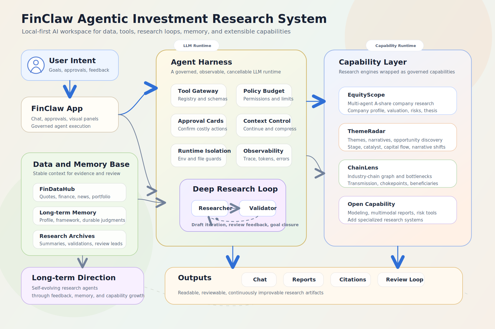

# FinClaw

<div align="center">

**An agentic investment research and learning system for individual investors**

FinClaw turns professional research workflows, data tools, agent capabilities, validation loops, and long-term memory into a local AI workspace for personal investors.

[中文](./README.md) | [English](./README-EN.md)

</div>

---

## Why FinClaw Exists

FinClaw is not a simple AI stock analysis system or a market dashboard. It aims to become a genuinely useful AI investment foundation and to answer a more practical question:

> Can individual investors use AI’s information-gathering and analytical capabilities, together with multi-agent collaboration, to gain research and analysis capabilities close to those of professional investment teams, and learn by using the system to improve their own investment cognition?

Most individual investors do not lack information. They lack the ability to turn information into judgment. News, filings, reports, social media, quotes, and fundamentals keep growing every day, but more information does not automatically produce better decisions.

Individual investors often face persistent problems:

- **Surface-level interpretation**: reacting to headlines, market heat, and short-term price moves without understanding deeper industry transmission, policy lag, expectation gaps, or capital-flow structure.
- **Weak research reasoning**: seeing direct effects but missing second-order effects, indirect impacts, reflexivity, and scenario analysis.
- **Emotion-driven decisions**: becoming overly optimistic during rallies and overly pessimistic during drawdowns, turning investing into short-term gambling.
- **No stable investment system**: lacking a repeatable framework, risk management, position discipline, probabilistic thinking, and falsification habits.
- **Poor memory and review loops**: every research task becomes a one-off effort; mistakes, lessons, and useful frameworks are not carried into future decisions.
- **No professional collaboration mechanism**: investment teams use collection, hypothesis building, cross-checking, risk review, and follow-up tracking, while individuals usually face complex information flows alone.

FinClaw is not designed to make decisions for users. It is designed to help users build a better decision-making system: to reason deeper, evaluate risks more clearly, and understand the limits of their own knowledge.

## What Is FinClaw?

FinClaw is a local-first, observable, and extensible financial agent system. It is built around real investment research tasks, not single-turn Q&A.

Its core idea is not to let an LLM directly answer stock questions, but to build a governed **Agent Harness** around the LLM:

- A tool gateway keeps LLM actions inside explicit, auditable, permission-controlled boundaries.
- A Deep Research loop supports long-running, multi-step, reviewable research tasks.
- DataHub turns quotes, fundamentals, news, portfolios, and watchlists into callable capabilities.
- Long-term memory preserves user profile, investment framework, durable judgments, and claims that require future validation.
- The Capability Layer connects professional research engines and allows the system’s analytical boundary to expand continuously.
- LLM logs, tool traces, and research threads make conclusions inspectable.

FinClaw is closer to an **Agentic Investment Research Workspace**: the user provides a research goal, the agent understands the task, calls tools, collects evidence, organizes analysis, writes reports, and gradually accumulates the user’s own investment framework over time.

## System Design

<p align="center">
  
</p>

### Agent Harness

Financial workflows should not rely on unconstrained model behavior. FinClaw uses tool registration, argument validation, permission control, approval cards, timeout control, cancellation, trace logs, and filesystem isolation to place the LLM inside a governed execution environment.

This allows the agent to use real tools, suppress hallucinated tool usage, and prevent direct access to `.env`, databases, source code, or arbitrary local files.

### Deep Research Loop

Complex research usually cannot be completed in one call. FinClaw’s Deep Research uses a loop between a research agent and a validator agent. The research agent freely calls research tools for deeper investigation and maintains the research draft; the validator acts like a reviewer, checking whether the reasoning is sufficient, aligned with the user’s research framework, and free of obvious gaps until the research objective is satisfied.

This moves the system from simple “material summarization” toward “research reasoning.”

### Capability Layer

FinClaw does not aim to expose dozens of fragmented APIs to the model or the user. It packages complete research abilities as capabilities, so external research engines can become professional tools inside the system.

The current capability layer includes:

| Capability | Role |
| --- | --- |
| EquityScope / 个股深研 | Multi-agent A-share single-company research capability that simulates professional investment research roles, debates a target company, and outputs an equity research report. |
| ThemeRadar / 主线雷达 | Market theme, narrative structure, and opportunity discovery capability that studies macro fundamentals and market direction to identify short- and long-term market themes. |
| ChainLens / 产业链透视 | Industry-chain graph, bottleneck, and structural opportunity analysis capability that studies industrial-chain nodes, bottleneck intensity, and market attention to discover potential investment opportunities. |

More importantly, the Capability Layer is open and extensible. Future capabilities may include financial modeling, multimodal research-material parsing, portfolio risk control, and other specialized research systems.

### Investment Cognition Growth

FinClaw aims to help users gradually form their own investment system. Long-term memory is not just chat summarization. It is structured around longer-lived objects:

- User profile: investment stage, preferences, risk tolerance, and cognitive traits.
- Investment framework: research dimensions, methods, and principles accepted and refined by the user.
- Durable judgments: views, risk boundaries, and follow-up claims that need future validation.
- Research archives: theses, evidence, conclusions, and pending validations from deep research.

Future versions will strengthen cognition levels, tasks, review workflows, risk management, probabilistic thinking, and metacognition training, so the system can not only answer questions but also help users become more professional and move beyond a speculative retail mindset.

## Current Capabilities

| Layer | Description |
| --- | --- |
| Agent Core | OpenAI-compatible tool-calling loop with SSE streaming, tool calls, approval cards, cancellation, and context governance |
| Data Layer | Embedded FinDataHub for A-share quotes, fundamentals, news, market overview, watchlists, and portfolios |
| Research Loop | Deep Research background threads with draft iteration, validator review, and research archives |
| Memory Layer | User profile, investment framework, durable judgments, research consensus, and long-term memory extraction |
| Web Verification | Web search, source collection, and inline citations for verifying news, reports, social media claims, and external facts |
| Capability Layer | Unified extension interface with permissions, health checks, timeouts, enablement, and professional research engines |
| Observability | LLM requests, responses, token usage, tool calls, errors, and traces |
| Frontend Workspace | Chat, Deep Research, research archives, long-term memory, capabilities, LLM logs, and data panels |

## Technical Highlights

- **Governed agent execution**: the LLM can act only through registered tools; sensitive tools can require user approval.
- **Deep Research Loop**: the research agent improves the draft, while the validator reviews reasoning quality.
- **Capability Plugin System**: complete research engines can be integrated as permission-controlled, health-checked, observable agent capabilities.
- **Local-first data and memory**: conversations, research records, long-term memory, portfolio data, and DataHub data are stored locally by default.
- **Financial agent safety boundaries**: local file access is isolated; the LLM does not directly read sensitive configs, source code, or databases.
- **Traceable LLM observability**: model calls, tool calls, and errors can be inspected to debug agent behavior.
- **Investment-growth design**: research frameworks, memory, archives, and pending validations help the user’s investment process evolve.

## Architecture

```text
FinClaw/
├─ backend/                 # API, agent loop, tool gateway, memory, research
│  ├─ core/                 # LLM loop, prompt builder, tool gateway, policy
│  ├─ services/             # sessions, memory, research, observability, capabilities
│  ├─ tools/                # tools available to the agent
│  ├─ skills/               # progressive tool/process instructions
│  └─ prompts/              # core and memory prompts
├─ services/findatahub/     # embedded market data service
├─ web/                     # React frontend
├─ capabilities/            # built-in and optional capability plugins
│  ├─ tradingagents_astock/ # EquityScope / 个股深研
│  ├─ bettafish/            # ThemeRadar / 主线雷达 manifest
│  └─ tradinggraph/         # ChainLens / 产业链透视 manifest
├─ docs/
├─ .env.example
├─ LICENSE
└─ NOTICE
```

## Quick Start

### 1. Prepare environment

```powershell
git clone https://github.com/Yuqi2347/finclaw-oss.git
cd finclaw-oss
Copy-Item .env.example .env
```

Configure at least one OpenAI-compatible LLM:

```env
FINCLAW_LLM_API_KEY=
FINCLAW_LLM_BASE_URL=https://api.openai.com/v1
FINCLAW_LLM_MODEL=gpt-4.1-mini
```

Optional providers:

```env
TUSHARE_TOKEN=
TAVILY_API_KEY=
```

### 2. Install backend dependencies

```powershell
python -m pip install -r requirements.txt
```

### 3. Start backend

```powershell
python -m uvicorn backend.app:app --host 127.0.0.1 --port 8800
```

FinDataHub is embedded by default at:

```text
http://127.0.0.1:8800/datahub
```

### 4. Start frontend

```powershell
cd web
npm install
npm run dev
```

Open:

```text
http://127.0.0.1:5170
```

## Capability Extensions

FinClaw uses a unified `capabilities/` structure to manage external research abilities. A capability can be a complete research engine or an adapter around an existing system.

The current OSS package includes EquityScope / 个股深研.

ThemeRadar / 主线雷达 and ChainLens / 产业链透视 capability manifests are included but disabled by default. Users can enable them after installing the corresponding implementations:

```env
# BETTAFISH_ROOT=../BettaFish
# TRADINGGRAPH_ROOT=../TradingGraph
```

In the future, FinClaw aims to support a smoother capability onboarding flow: users should be able to connect an existing research project and generate the manifest, health checks, tool contract, and agent instructions.

## Roadmap

### Current stage

- Local AI investment research agent loop
- Embedded FinDataHub
- Web search with citations
- Long-term memory and investment framework persistence
- Deep Research background loop
- EquityScope / 个股深研 capability integration
- LLM logs and tool-call observability
- Basic frontend research workspace

### Next stage

- Optimize and open ThemeRadar / 主线雷达 and ChainLens / 产业链透视
- Better capability plugin developer experience and automatic onboarding
- Stronger Deep Research Loop analysis capability and research archive quality
- Investment learning system: levels, tasks, review, evaluation, and user profile

### Long-term Exploration: Self-Evolving Financial Research Agent

FinClaw is not yet a fully self-evolving agent, but it already has several foundations required for that direction: long-term memory, an editable investment framework, the Deep Research Loop, the Capability Layer, LLM observability, and research archives. The long-term goal is to let the system continuously improve its research capability through user feedback, research reviews, tool performance, and market validation.

- **Research framework evolution**: FinClaw already maintains the user's investment framework in long-term memory and supports manual editing. The next step is to help the system abstract reusable research principles from research results, user challenges, review conclusions, and market validation, continuously improving the user's own research framework.
- **Research-quality feedback loop**: Validator feedback, user feedback, and later market validation should not only evaluate a single report. They should also update the research framework, risk checklists, tool-selection strategy, and prompt / skill instructions, allowing the system to learn from both successful and failed cases.
- **Capability Evolution**: The system should be able to identify capability gaps during research, such as missing data sources, insufficient industry-chain analysis, or low-quality tool output, and assist in generating new capability requirements, integration contracts, health checks, and tool instructions to expand its research boundary.
- **Human-in-the-loop Learning**: FinClaw's growth should be calibrated by the user. User confirmations, edits, challenges, reviews, tool preferences, and risk-preference settings should become feedback signals for updating memory, research frameworks, and tool strategies.

## Collaboration

FinClaw is still in an early exploration stage. This project is not a finished answer; it is an evolving system for exploring how individual investors can use AI to gain stronger research capabilities, how agents can use tools reliably in financial workflows, and how investment cognition can be recorded, reviewed, and improved over time.

Discussions and improvements are welcome in areas such as:

- Agent loops, tool gateways, memory, and observability
- Financial data engineering, A-share data sources, fundamentals, news, and filings
- Investment research frameworks, sector research, company research, and review workflows
- Automatic transformation and onboarding of external research engines
- Self-evolution of agent system capabilities

## Disclaimer

FinClaw is an investment research and learning tool. It does not provide financial advice. Outputs may contain errors, omissions, or outdated information. Users are responsible for their own investment decisions and risks.

## Acknowledgements

Parts of FinClaw's capability integration and implementation benefit from the open-source community, especially TauricResearch/TradingAgents and related A-share adaptations that inspired the multi-agent research workflow. See [NOTICE](./NOTICE) for license and modification details.

## License

Apache License 2.0. See [LICENSE](./LICENSE) and [NOTICE](./NOTICE).
