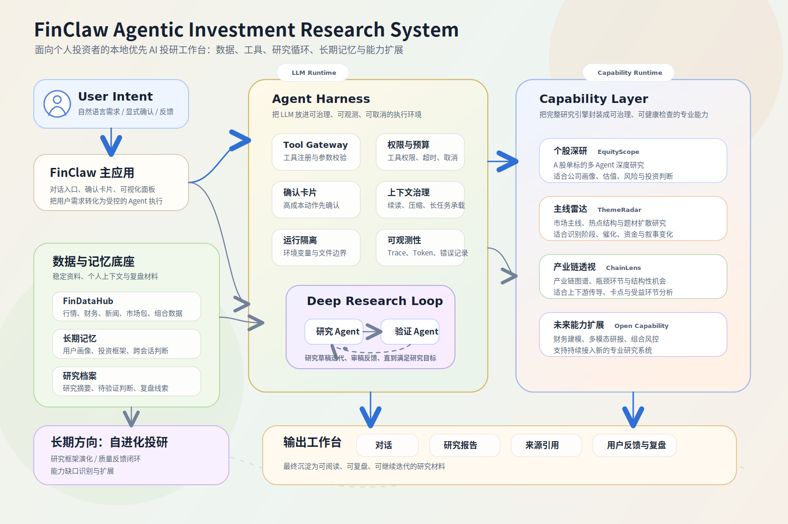

# FinClaw

<div align="center">

**面向个人投资者的 Agentic 投研与投资认知成长系统**

把专业投研团队的研究流程、数据工具、Agent 能力、验证机制和复盘记忆，转化为个人投资者可以长期使用和持续进化的本地 AI 工作台。

[English](./README-EN.md) | [中文](./README.md)

</div>

---

## 为什么需要 FinClaw

FinClaw 不是一个简单的“AI 股票分析系统”，也不是一个简单的行情看板。它试图成为一个真实有价值的AI投资底座，并且回答一个更现实的问题：

> 个人投资者能否借助 AI 的强大信息搜集与分析能力以及多agent协作，获得接近专业投研团队的研究分析能力，并在能够“用中学”，真正提升自己的投资认知？

个人投资者真正缺少的通常不是信息，而是把信息转化为判断的能力。新闻、研报、社媒、行情和财务数据每天都在增加，但大量信息并不会自动形成有效认知。很多时候，个人投资者会陷入几个长期问题：

- **只看到表层信息**：容易追逐市场热点、新闻刺激和短期涨跌，却很难识别产业链传导、政策滞后效应、预期差、资金结构变化等更深层逻辑。
- **缺少投研推理能力**：对一个事件的直接影响很敏感，但对二阶影响、间接影响、反身性和情景推演不够敏感。
- **容易被情绪驱动**：在上涨时过度乐观，在下跌时过度悲观，把投资变成追涨杀跌和短期赌博。
- **缺少投资系统**：没有稳定的研究框架、风险管理、仓位纪律、概率思维和反证机制。
- **缺少复盘与记忆**：每次研究都像一次性消费，错误、经验和有效框架无法沉淀到下一次判断中。
- **缺少专业协作机制**：专业投研团队会有资料收集、研究假设、交叉验证、风险审查和持续跟踪，而个人投资者通常只能独自面对复杂信息流。

FinClaw 的目标不是替用户做投资决定，而是帮助用户建立更专业的判断系统：看得更深，想得更完整，知道风险在哪里，也知道自己的认知边界在哪里。

## 什么是 FinClaw 

FinClaw 是一个本地优先、可观测、可扩展的金融 Agent 系统。它围绕真实投研任务构建，而不是围绕单轮问答构建。

它的核心不是“让 LLM 直接回答股票问题”，而是为 LLM 构建一个受控的 **Agent Harness**：

- 通过工具网关把 LLM 的行动限制在明确、可审计、可权限控制的工具边界内。
- 通过 Deep Research loop 支持长时间、多轮、可验证的研究任务。
- 通过 DataHub 把行情、财务、新闻、组合和关注列表等数据统一为可调用能力。
- 通过长期记忆沉淀用户画像、投资框架、跨会话判断和待验证观点。
- 通过 Capability Layer 接入专业的研究引擎，让系统的分析边界可以无限扩展。
- 通过 LLM 日志、工具调用记录和研究线程，让一次结论如何产生变得可追踪。

FinClaw 更接近一个 **Agentic Investment Research Workspace**：用户提出研究目标，Agent 理解问题、调用工具、收集证据、组织分析、沉淀报告，并在长期使用中逐步积累用户自己的投资框架。

## 系统设计

<p align="center">
  
</p>

### Agent Harness

金融场景不能只依赖模型自由发挥。FinClaw 使用工具注册、参数校验、权限控制、确认卡片、超时控制、取消机制、日志追踪和文件访问隔离，把 LLM 的能力放进可治理的执行环境中。

这使得 Agent 能够使用真实工具完成任务，抑制幻觉调用，同时避免直接暴露 `.env`、数据库、源码和任意本地路径。

### Deep Research Loop

复杂研究通常不是一次调用就能完成。FinClaw 的 Deep Research 使用研究 Agent 与验证 Agent 的循环机制：研究 Agent 自由调用研究工具进行深度研究维护研究草稿，验证 Agent 像审稿人一样检查论证是否充分、是否符合用户的研究框架、是否存在明显空洞。直到验证满足研究目标。

这让系统可以从简单的“资料总结”走向“研究推理”。

### Capability Layer

FinClaw 不希望把几十个零散 API 暴露给用户或模型。它将完整的研究能力封装为 capability，让外部研究引擎可以作为专业能力接入系统。

当前能力层包括：

| Capability | 定位 |
| --- | --- |
| 个股深研 / EquityScope | 面向 A 股单标的的多 Agent 深度研究能力，通过模拟投研团队角色进行深度标的研究辩论，输出专业个股研究报告。 |
| 主线雷达 / ThemeRadar | 面向市场主线、热点结构和主题机会挖掘的研究能力，通过对宏观基本面和市场走向的研究分析长短期市场主线。 |
| 产业链透视 / ChainLens | 面向产业链图谱、瓶颈环节和结构性机会分析的研究能力，通过对产业链节点、瓶颈度和市场关注度的分析，寻找潜在投资机会。 |

更重要的是，Capability Layer 是开放可扩展的。未来可以继续接入财务建模、多模态研究材料解析、组合风控等其他专业研究系统。

### 投资认知成长

FinClaw 希望帮助用户逐步形成自己的投资系统。长期记忆不只是聊天摘要，而是围绕几个更长期的对象沉淀：

- 用户画像：用户的投资阶段、偏好、风险承受能力和认知特点。
- 投资框架：用户认可并持续修正的研究维度、分析方法和判断原则。
- 跨会话判断：需要未来验证的观点、风险边界和跟踪事项。
- 研究档案：一次深度研究的论点、证据、结论和待验证判断。

未来 FinClaw 会继续强化 认知程度、任务、复盘、风险管理、概率思维和元认知训练，让系统不仅能回答问题，也能帮助用户变得更专业，摆脱“韭菜”思维。

## 当前能力

| 能力层 | 说明 |
| --- | --- |
| Agent Core | OpenAI-compatible tool-calling 主循环，支持 SSE 流式输出、工具调用、确认卡片、中断控制和上下文治理 |
| Data Layer | 内嵌 FinDataHub，提供 A 股行情、财务、新闻、市场概览、关注列表和组合数据 |
| Research Loop | Deep Research 后台线程，支持研究草稿迭代、验证 Agent 审稿和研究档案沉淀 |
| Memory Layer | 用户画像、投资框架、跨会话判断、研究共识和长期记忆提取 |
| Web Verification | 联网搜索、来源整理和正文引用，用于验证新闻、研报、社媒信息和外部事实 |
| Capability Layer | 统一扩展能力接口，支持权限、健康检查、超时、启用状态和专业研究引擎接入 |
| Observability | LLM 请求、响应、token、工具调用、错误和 trace 记录 |
| Frontend Workspace | 对话、深度研究、研究档案、长期记忆、能力插件、LLM 日志和数据面板 |

## 技术亮点

- **受控 Agent 执行环境**：LLM 只能通过注册工具行动，关键工具可要求用户确认。
- **Deep Research Loop**：研究 Agent 负责生成和完善研究草稿，Validator 负责审查论证质量。
- **Capability Plugin System**：把完整研究引擎接入为可权限控制、可健康检查、可观测的 Agent 能力。
- **本地优先数据与记忆**：会话、研究记录、长期记忆、组合和 DataHub 数据默认保存在本地。
- **金融 Agent 安全边界**：隔离本地文件访问，避免 LLM 直接读取敏感配置、源码和数据库。
- **可追踪 LLM 观测系统**：每次模型调用、工具调用和错误都可以回看，便于调试 Agent 行为。
- **投资成长设计**：通过研究框架、长期记忆、档案和待验证判断，让用户的投资方法可以持续演化。

## 架构概览

```text
FinClaw/
├─ backend/                 # FinClaw API、Agent Loop、工具网关、记忆、研究线程
│  ├─ core/                 # LLM loop、prompt builder、tool gateway、policy
│  ├─ services/             # 会话、记忆、研究、观测、能力插件、DataHub 代理
│  ├─ tools/                # Agent 可调用工具
│  ├─ skills/               # 工具/流程的渐进式说明
│  └─ prompts/              # 核心 prompt 与记忆 prompt
├─ services/findatahub/     # 内嵌市场数据服务
├─ web/                     # React 前端
├─ capabilities/            # 内置与可选扩展能力插件
│  ├─ tradingagents_astock/ # 个股深研 / EquityScope
│  ├─ bettafish/            # 主线雷达 / ThemeRadar manifest
│  └─ tradinggraph/         # 产业链透视 / ChainLens manifest
├─ docs/                    # 架构、数据、记忆和可观测性文档
├─ .env.example
├─ LICENSE
└─ NOTICE
```

## 快速开始

### 1. 准备环境

```powershell
git clone https://github.com/Yuqi2347/finclaw-oss.git
cd finclaw-oss
Copy-Item .env.example .env
```

编辑 `.env`，至少配置一个 OpenAI-compatible LLM：

```env
FINCLAW_LLM_API_KEY=
FINCLAW_LLM_BASE_URL=https://api.openai.com/v1
FINCLAW_LLM_MODEL=gpt-4.1-mini
```

可选配置：

```env
TUSHARE_TOKEN=
TAVILY_API_KEY=
```

### 2. 安装后端依赖

```powershell
python -m pip install -r requirements.txt
```

这会安装 FinClaw 后端、内嵌 FinDataHub，以及内置的个股深研 / EquityScope 能力依赖。主线雷达 / ThemeRadar 和产业链透视 / ChainLens 属于可选外部能力，需在安装对应实现后再启用。

### 3. 启动后端

```powershell
python -m uvicorn backend.app:app --host 127.0.0.1 --port 8800
```

FinDataHub 默认以内嵌模式挂载在：

```text
http://127.0.0.1:8800/datahub
```

### 4. 启动前端

```powershell
cd web
npm install
npm run dev
```

访问：

```text
http://127.0.0.1:5170
```

## Capability 扩展

FinClaw 使用统一的 `capabilities/` 结构管理外部研究能力。一个 capability 可以是完整研究引擎，也可以是对已有系统的适配层。

当前开源包内置个股深研 / EquityScope。

同时保留主线雷达 / ThemeRadar 和产业链透视 / ChainLens 的 capability manifest，但默认关闭。用户可以在安装对应实现后通过环境变量启用：

```env
# BETTAFISH_ROOT=../BettaFish
# TRADINGGRAPH_ROOT=../TradingGraph
```

未来希望支持更自动化的能力接入流程：用户可以把一个已有研究项目接入 FinClaw，系统辅助生成 manifest、健康检查、工具契约和 Agent 使用说明。

## 路线图

### 当前阶段

- 本地 AI 投研 Agent 主循环
- FinDataHub 内嵌化
- Web Search 和引用展示
- 长期记忆与投资框架沉淀
- Deep Research 后台研究循环
- 个股深研 / EquityScope capability 接入
- LLM 日志与工具调用观测
- 前端研究工作台基础界面

### 下一阶段

- 优化开放主线雷达 / ThemeRadar 和产业链透视 / ChainLens
- 完善 capability 插件开发规范和自动接入工具
- 强化 Deep Research Loop 的专业分析能力和研究档案质量
- 完善投资成长体系：level、任务、复盘、能力评估与用户画像

### 长期探索：自进化金融研究 Agent

FinClaw 当前还不是一个完整的自进化 Agent，但已经具备若干自进化所需的基础模块：长期记忆、可编辑投资框架、Deep Research Loop、Capability Layer、LLM 调用观测和研究档案。长期目标是让系统能够从用户反馈、研究复盘、工具表现和市场验证中持续改进自身的研究能力。

- **研究框架演化**：FinClaw 已经会在长期记忆中维护用户的投资框架，并支持用户手动编辑。未来需要进一步让系统从研究结果、用户质疑、复盘结论和市场验证中抽象出可复用的研究原则，持续优化用户自己的投研框架。
- **研究质量反馈闭环**：Validator、用户反馈和后续市场验证不应只用于评价一次报告，而应反向影响研究框架、风险检查项、工具选择策略和 prompt / skill 说明，让系统在错误和成功案例中积累改进。
- **Capability Evolution**：系统需要能够识别研究过程中的能力缺口，例如缺少数据源、缺少产业链分析、工具输出质量不足等，并辅助生成新的 capability 需求、接入契约、健康检查和工具说明，逐步扩展自己的研究能力边界。
- **Human-in-the-loop Learning**：FinClaw 的成长应当由用户参与校准。用户的确认、编辑、质疑、复盘、工具偏好和风险偏好设置，都会成为系统更新记忆、研究框架和工具策略的反馈信号。

## 开源协作

FinClaw 仍处于早期探索阶段。这个项目不是一个已经完成的答案，而是一个正在形成的系统：如何让个人投资者借助 AI 获得更专业的研究能力，如何让 Agent 在金融场景中可靠地使用工具，如何让投资认知能够被记录、复盘和持续改进。

欢迎对以下方向感兴趣的人一起探讨优化：

- Agent loop、tool gateway、memory、observability
- 金融数据工程、A 股数据源、财务数据、新闻与公告数据
- 投资研究框架、行业研究、公司研究、交易复盘
- 自动外部研究引擎改造接入
- agent 系统能力自进化


## 重要说明

FinClaw 是一个投资研究和学习工具，不构成任何投资建议。系统输出可能包含错误、遗漏或过时信息。任何投资决策都应由用户独立判断，并自行承担风险。

## 开源致谢

FinClaw 的部分能力接入和实现受益于以下开源项目：

- [TauricResearch/TradingAgents](https://github.com/TauricResearch/TradingAgents)：提供多 Agent 金融投研框架的原始思路与实现基础。
- [simonlin1212/tradingagents-astock](https://github.com/simonlin1212/tradingagents-astock)：提供 A 股场景特化的 TradingAgents 改造基础。

具体许可证和改造说明见 [NOTICE](./NOTICE)。

## License

Apache License 2.0. See [LICENSE](./LICENSE) and [NOTICE](./NOTICE).
